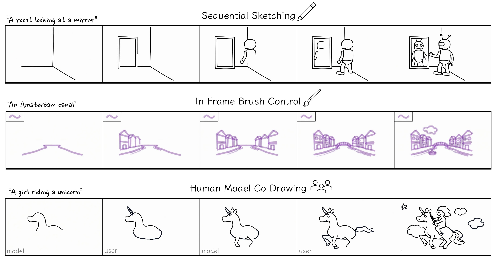

<div align="left">

# ✏️ VideoSketcher

### Video Models Prior Enable Versatile Sequential Sketch Generation

<p align="left">
  
  
  
  
</p>

<p align="left">
  <a href="https://videosketcher.github.io/">🌐 Project Page</a> •
  <a href="#-key-features">Features</a> •
  <a href="#-getting-started">Getting Started</a> •
  <a href="#inference">Inference</a> •
  <a href="#-interactive-demo">Demo</a> •
  <a href="#-training">Training</a>
</p>

---

**VideoSketcher** generates sequential sketching processes where drawings emerge progressively on a blank canvas, following semantically meaningful orders. By combining LLMs for semantic planning with video diffusion models for visual rendering, we bridge the gap between understanding *what* to draw, *when* to draw it, and *how* to render it beautifully.
<p align="left">

</p>


</div>

---

## ✨ Key Features

| Feature | Description |
|:--------|:------------|
| 🎨 **Text-to-Video Sketching** | Generate sketch animations from text descriptions with LLM-guided drawing plans |
| 🖼️ **Brush-Controlled Sketching (Image-conditioned)** | Given the first frame (blank canvas with a brush scribble on top-left corner), generate a sketch sequence with the same brush color/style (**brush control**, internally referred to as I2V) |
| 🔄 **Autoregressive Generation** | Create extended-length videos through sequential frame prediction |
| 🎮 **Interactive Co-Drawing** | Real-time collaborative drawing with turn-based human-AI interaction based on our autoregressive model |
| ⚡ **Efficient Fine-Tuning** | Two-stage LoRA training requiring only 7 real artist sketches |

---

## 🚀 Getting Started


### Environment Setup

```bash
conda env create -f environment.yml
conda activate video_sketcher_env
bash setup_env.sh
```

### Recommended Setup

- **GPU**: CUDA-enabled NVIDIA GPU recommended. For inference, we recommend using a GPU with at least 48GB VRAM for T2V and I2V(brush style control), and 30GB VRAM for autoregressive model. For training, we recommend using multiple GPUs with at least 80GB VRAM.
- **Inference time**:
  - **T2V / Brush-Controlled**: Each run generates a 480p resolution, 81-frame video with 50 diffusion steps. This takes 16 minutes on a A100 GPU.
  - **Autoregressive (AR)**: Each run for a 81-frame 480p resolution video takes about 11 seconds on a A100 GPU.

---
### 📦 Download Model Checkpoints

It’s recommended to download related model checkpoints before running commands. VideoSketcher uses:

**Base Wan2.1 models (required)**: diffusion weights + text encoder + VAE (and an extra image encoder for brush-controlled mode).
```bash
# Base Wan2.1 Text-to-Video model
hf download Wan-AI/Wan2.1-T2V-14B --local-dir pretrained/Wan-AI/Wan2.1-T2V-14B

# Base Wan2.1 Image-to-Video model (for brush style control)
hf download Wan-AI/Wan2.1-I2V-14B-480P --local-dir pretrained/Wan-AI/Wan2.1-I2V-14B-480P

# Base Wan2.1 1.3B Text-to-Video model (for autoregressive model)
hf download Wan-AI/Wan2.1-T2V-1.3B --local-dir pretrained/Wan-AI/Wan2.1-T2V-1.3B
```
**VideoSketcher LoRA weights**: lightweight adapters that turn the base model into a sequential sketch generator.
```bash
# LoRA weights for text-to-sketch generation
hf download VideoSketcher/VideoSketcher-models --include "VideoSketcher_T2V/*" --local-dir pretrained/VideoSketcher/VideoSketcher-models

# LoRA weights for brush style control model
hf download VideoSketcher/VideoSketcher-models --include "VideoSketcher_I2V/*" --local-dir pretrained/VideoSketcher/VideoSketcher-models
```
**Autoregressive (AR) checkpoint**: distilled model used by the interactive demo and AR rollout generation.
```bash
# Autoregressive model (for interactive demo / AR generation)
hf download VideoSketcher/VideoSketcher-models --include "VideoSketcher_AR/*" --local-dir pretrained/VideoSketcher/VideoSketcher-models
```


---

<a id="inference"></a>
## ✏️ Sequential Sketching (T2V) - Inference


To generate a sequential sketch video for a given prompt, run the command below. Results will be saved under `output_dir`, with one subfolder per prompt (e.g. `./<output_dir>/<prompt_keywords>/`), containing the generated `.mp4` video.

**Single Prompt:**

```bash
python inference.py \
    --model_id_with_origin_paths "Wan-AI/Wan2.1-T2V-14B:diffusion_pytorch_model*.safetensors,Wan-AI/Wan2.1-T2V-14B:models_t5_umt5-xxl-enc-bf16.pth,Wan-AI/Wan2.1-T2V-14B:Wan2.1_VAE.pth" \
    --lora_ckpt pretrained/VideoSketcher/VideoSketcher-models/VideoSketcher_T2V/T2V_lora_14B.safetensors \
    --prompt "Step by step sketch process of a girl riding a unicorn in the sky, following this drawing order: 1. Unicorn body – large horse-like shape. 2. Legs – running or floating pose. 3. Head and horn. 4. Rider – seated figure on the back. 5. Mane and tail flowing. 6. Clouds around them." \
    --output_dir ./outputs/t2v_inference \
    --seed 42 \
```

**📝 Prompt Format:**

You can customize the `--prompt` argument with your own content. For best results, follow this template:
```
"Step by step sketch process of a <concept>, following this drawing order: 1. <first element>. 2. <second element>. 3. ..."
```
This allows you to control the exact drawing sequence.

**✨ Auto-Extend (simple concept → detailed drawing instructions):**

If you prefer to provide only a general concept without specifying the drawing order, simply use a short prompt with the `--extend_prompt` flag:
The `--extend_prompt` flag will automatically expand your concept into the full template format with a suggested drawing order.

> **Optional:** For improved prompt extension, you can set an OpenAI API key in a `.env` file:
> ```
> OPENAI_API_KEY=your_key_here
> ```
> If no API key is provided, the system will fall back to using Qwen for prompt extension.

Command exmaple:
```bash
python inference.py \
    --model_id_with_origin_paths "Wan-AI/Wan2.1-T2V-14B:diffusion_pytorch_model*.safetensors,Wan-AI/Wan2.1-T2V-14B:models_t5_umt5-xxl-enc-bf16.pth,Wan-AI/Wan2.1-T2V-14B:Wan2.1_VAE.pth" \
    --lora_ckpt pretrained/VideoSketcher/VideoSketcher-models/VideoSketcher_T2V/T2V_lora_14B.safetensors \
    --prompt "girl riding a unicorn in the sky" \
    --extend_prompt \
    --output_dir ./outputs/t2v_inference \
    --cfg_scale 5.0 \
    --seed 42
```

To generate sketches for **multiple prompts** in one run, put one prompt per line in a text file (see `input_examples/inference_prompts/prompts_t2v.txt`) and run:

```bash
# Arguments:
#   $1 - LoRA checkpoint path (output will be saved in the same directory)
#   $2 - Prompts file
#   $3 - Seed
#   $4 - Inference steps
#   $5 - Guidance scale
bash scripts/T2V_inference_lora_14B.sh \
    pretrained/VideoSketcher/VideoSketcher-models/VideoSketcher_T2V/T2V_lora_14B.safetensors \
    input_examples/inference_prompts/prompts_t2v.txt \
    42 \
    50 \
    5.0
```

## 🖌️ Brush Style Condition (I2V) - Inference

To generate a sequential drawing of the desired prompt conditioned on a given brush style, run the following command. We provide an example using a pink calligraphic pen (see `input_examples/brush_control_image_condition/caligraphy-vertical_pink.jpg`). 
To use your own brush style, replace the example brush image with your own, following the same structure for best performance.

**Single Prompt:**

```bash
# cfg_scale: classifier-free guidance scale, we use 2.0 for the brush style control
python inference.py \
    --model_id_with_origin_paths "Wan-AI/Wan2.1-I2V-14B-480P:diffusion_pytorch_model*.safetensors,Wan-AI/Wan2.1-I2V-14B-480P:models_t5_umt5-xxl-enc-bf16.pth,Wan-AI/Wan2.1-I2V-14B-480P:Wan2.1_VAE.pth,Wan-AI/Wan2.1-I2V-14B-480P:models_clip_open-clip-xlm-roberta-large-vit-huge-14.pth" \
    --lora_ckpt pretrained/VideoSketcher/VideoSketcher-models/VideoSketcher_I2V/I2V_lora_14B.safetensors \
    --prompt "Step by step sketch process of a girl riding a unicorn in the sky, using the color and style of the brush shown in the top-left corner, following this drawing order: 1. Unicorn body – large horse-like shape. 2. Legs – running or floating pose. 3. Head and horn. 4. Rider – seated figure on the back. 5. Mane and tail flowing. 6. Clouds around them." \
    --output_dir ./outputs/brush_control_inference \
    --seed 42 \
    --input_image ./input_examples/brush_control_image_condition/caligraphy-vertical_pink.jpg \
    --cfg_scale 2.0
```


**Inference with prompts file:**

```bash
# Arguments:
#   $1 - LoRA checkpoint path
#   $2 - Prompts file
#   $3 - Condition image path
#   $4 - Seed
#   $5 - Inference steps
#   $6 - Guidance scale (classifier-free guidance scale, we use 2.0 for brush style control)
bash scripts/I2V_inference_lora_14B.sh \
    pretrained/VideoSketcher/VideoSketcher-models/VideoSketcher_I2V/I2V_lora_14B.safetensors \
    input_examples/inference_prompts/prompts_brush_control.txt \
    input_examples/brush_control_image_condition/caligraphy-vertical_pink.jpg \
    42 \
    50 \
    2.0
```

#### More examples of condition images
```bash
hf download VideoSketcher/VideoSketcher-data --local-dir data --repo-type dataset --include "condition_first_frames.zip"
cd data && unzip "condition_first_frames.zip"
```

## ⚡ Autoregressive Generation (Fast Inference)

We provide an autoregressive generation mode using a lighter model for faster inference and co-drawing capabilities. While diffusion-based generation with the large model takes ~10 minutes per video, the autoregressive approach generates videos in just a few seconds.

**Rollouts:** Generate extended videos by rolling out frames sequentially. Each rollout produces 81 frames, with 9 overlapping frames between rollouts for smooth transitions.

| Rollouts | Output Frames |
|:--------:|:-------------:|
| 1 | 81 |
| 2 | 153 |
| 3 | 225 |
| n | n × 81 − (n−1) × 9 |

**Single Prompt:**
```bash
cd autoregressive
python ar_inference.py \
    --checkpoint_path ../pretrained/VideoSketcher/VideoSketcher-models/VideoSketcher_AR/AR_1.3B.pt \
    --prompt "Step by step sketch process of a girl riding a unicorn in the sky, following this drawing order: 1. Unicorn body – large horse-like shape. 2. Legs – running or floating pose. 3. Head and horn. 4. Rider – seated figure on the back. 5. Mane and tail flowing. 6. Clouds around them." \
    --seed 42 \
    --num_rollout 1 \
    --output_dir ../outputs/ar_inference
```

**With automatic prompt refinement:**

```bash
cd autoregressive
python ar_inference.py \
    --checkpoint_path ../pretrained/VideoSketcher/VideoSketcher-models/VideoSketcher_AR/AR_1.3B.pt \
    --prompt "girl riding a unicorn in the sky" \
    --extend_prompt \
    --seed 42 \
    --num_rollout 1 \
    --output_dir ../outputs/ar_inference
```

**Batch inference with prompts file:**
Arguments: `<checkpoint_path> <prompts_file> <seed> <num_rollout>`

```bash
cd autoregressive
# Arguments:
#   $1 - Checkpoint path (output directory will be the same as the checkpoint directory)
#   $2 - Prompts file
#   $3 - Seed
#   $4 - Number of rollouts
bash scripts/ar_inference.sh \
    ../pretrained/VideoSketcher/VideoSketcher-models/VideoSketcher_AR/AR_1.3B.pt \
    ../input_examples/inference_prompts/prompts_t2v.txt \
    42 \
    1
```

---

## 🎮 Interactive Demo

Experience real-time co-drawing with our interactive web interface:

```bash
cd interactive_demo

# Option 1: Use OpenAI API for prompt refinement
# Set your OpenAI API key in .env file: OPENAI_API_KEY=your_key_here
python server.py \
    --port 8000 \
    --refine_backend openai \
    --checkpoint_path ../pretrained/VideoSketcher/VideoSketcher-models/VideoSketcher_AR/AR_1.3B.pt

# Option 2: Use local Qwen2.5-7B-Instruct for prompt refinement (no API key needed)
python server.py \
    --port 8000 \
    --refine_backend qwen \
    --refine_model_name Qwen/Qwen2.5-7B-Instruct \
    --checkpoint_path ../pretrained/VideoSketcher/VideoSketcher-models/VideoSketcher_AR/AR_1.3B.pt
```

Open `http://localhost:8000/` in your browser and start drawing together with AI!


---
## 🔧 Training

### Dataset Preparation

```bash
hf download VideoSketcher/VideoSketcher-data --local-dir data --repo-type dataset
cd data && unzip "*.zip"
```

### Text-to-Video (T2V) Training

Our two-stage training strategy:
1. **Stage 1**: Learn drawing grammar on synthetic geometric compositions
2. **Stage 2**: Transfer sketch appearance using only 7 real artist sketches

```bash
export GPU_NUM=7

# Stage 1: Geometric primitives
# Arguments: $1-video_dir  $2-metadata_csv  $3-dataset_repeat  $4-epochs
bash scripts/T2V_train_lora_14B.sh \
    data/sketch_shapes/video \
    data/sketch_shapes/metadata_random_shapes.csv \
    100 \
    7

# Stage 2: Real sketches (continue from Stage 1)
# Arguments: $1-video_dir  $2-metadata_csv  $3-dataset_repeat  $4-epochs  $5-stage1_checkpoint
# Find the path to the stage1 checkpoint in the experiments/T2V-14B_lora directory
bash scripts/T2V_train_lora_14B.sh \
    data/sketch_real/video \
    data/sketch_real/metadata.csv \
    100 \
    7 \
    <path-to-stage1-checkpoint.safetensors>
```

### Brush Style Controlled Model Training

```bash
export GPU_NUM=7

# Stage 1: Styled geometric primitives
bash scripts/I2V_train_lora_14B.sh \
    data/style_shapes/style_train_path.txt \
    data/style_shapes/metadata_random_shapes_styles.csv \
    1 \
    7

# Stage 2: Real style sketches
# Arguments: $1-data_path  $2-metadata_csv  $3-dataset_repeat  $4-epochs  $5-stage1_checkpoint
# Find the path to the stage1 checkpoint in the experiments/I2V-14B_lora directory
bash scripts/I2V_train_lora_14B.sh \
    data/style_real/style_train_path.txt \
    data/style_real/metadata_styles.csv \
    1 \
    13 \
    <path-to-stage1-checkpoint.safetensors>
```

### Autoregressive Model Training

Distill the diffusion model into an autoregressive model for interactive applications:

```bash
export GPU_NUM=7
cd autoregressive
bash scripts/ar_train.sh \
    ../data/sketch_distill/data_combine \
    ../data/sketch_distill/metadata_50_combined.csv \
    100 \
    27
# checkpoint output path: autoregressive/experiments
```

---

## 📁 Project Structure

```
VideoSketcher/
├── inference.py          # Main inference script
├── train.py              # Training script
├── interactive_demo/     # Web-based interactive demo
├── autoregressive/       # AR model code and scripts
├── pipeline/             # Model pipeline implementations
├── scripts/              # Training and inference bash scripts
├── data/                 # Dataset and prompts
├── pretrained/           # Model checkpoints
└── utils/                # Utility functions
```

---

## 🙏 Acknowledgments

This project is built upon the following outstanding open-source works. We sincerely thank the authors for their contributions to the community:

| Project | Description |
|:--------|:------------|
| [**Wan2.1**](https://github.com/Wan-Video/Wan2.1) | State-of-the-art video generation foundation models that serve as our base architecture |
| [**CausVid**](https://github.com/tianweiy/CausVid) | Fast autoregressive video diffusion models (CVPR 2025) enabling our interactive generation pipeline |
| [**DiffSynth-Studio**](https://github.com/modelscope/DiffSynth-Studio) | Comprehensive diffusion model toolkit providing essential utilities and references |

---
<!-- 
## 📜 Citation

```bibtex
@article{videosketcher2026,
  title={VideoSketcher: Leveraging Video Model Priors for Versatile Sequential Sketch Generation},
  author={Anonymous},
  year={2026}
}
``` -->

---

<div align="center">
  <sub>Built with ❤️ for the creative AI community</sub>
</div>
